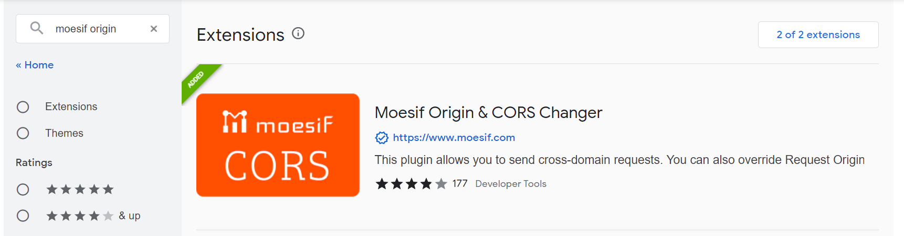
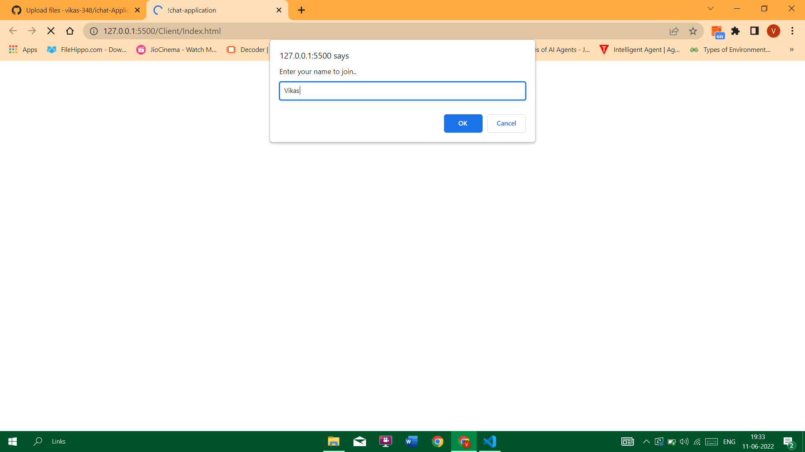
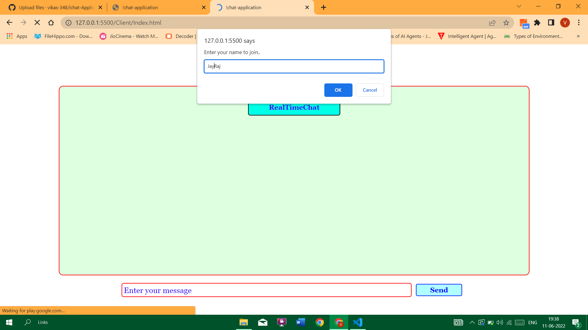
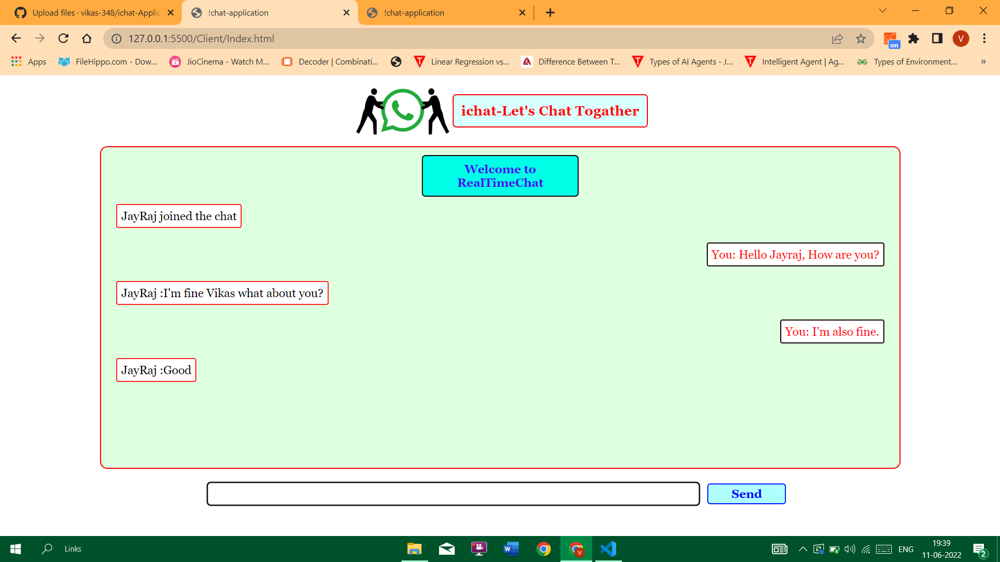
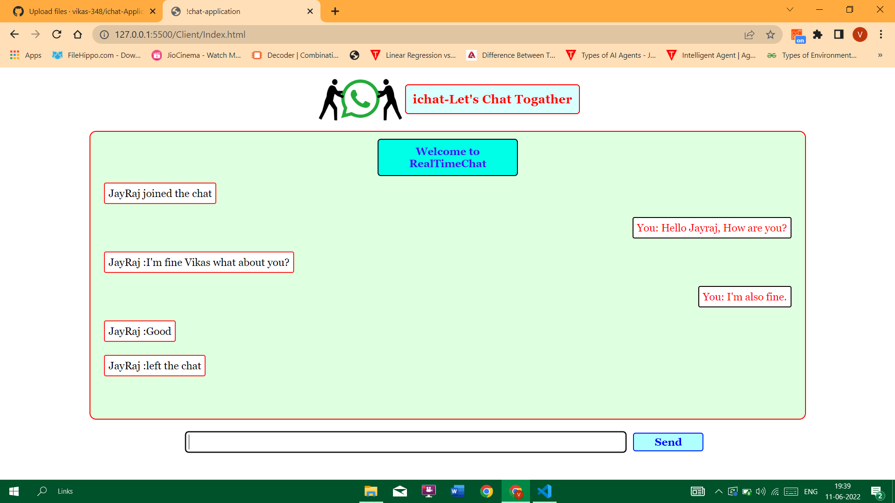

# ichat-Application-Using-Nodejs
Hello Guys here i have made a simple chat application. In this chat application you can talk to your friends  and invite your other friends also.

# Moesif Origin & CORS Changer

## Note:For sending or receiving the message you need an extra chrom plugins. After adding the plugins make sure it should be on while using the application.

# System Requirementse
## Hardware Requirements:
- Processor: Dual Core or higher
- Hard Drive: 500 GB or higher
- RAM: 2GB or higher
- Internet Connection: Preferred 1Mbps or higher

## Software Requirements: 
- Front-End Design: HTML, CSS, JavaScript
- Front-End:Nodejs, Socket.io
- Operating System: Windows 7 or higher
- Editor Tools: Pycharm/VScode 
- Web Browser: Google Chrome 

### Once you start the Application this will ask you to enter your name:

### By using the link you can invite your other friends to join the chat.

### Once your friends join the chat you will receive an message "Name" Join the chat and you can start the conversation with your friends.

### If your friend leave the chat then message will display as "Name" left the Chat.

